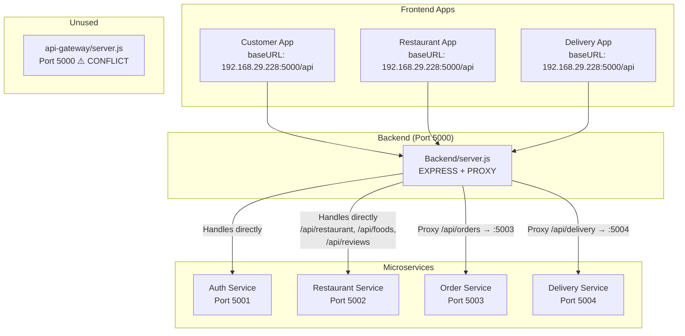

# 🔍 Complete System Validation Report

## 1. Architecture Overview & Issues

### Current Architecture



### 🚨 Critical Architecture Issues

| # | Issue | Severity | Details |
|---|-------|----------|---------|
| A1 | **Port Conflict** | 🔴 CRITICAL | `Backend/server.js` AND `api-gateway/server.js` BOTH default to port `5000`. Only one can run at a time. |
| A2 | **Dual Gateway** | 🟠 HIGH | Two gateways exist with different routing logic. `Backend/server.js` handles auth/restaurant/food/reviews **directly** (not proxied). `api-gateway` proxies everything. This creates inconsistency. |
| A3 | **Mixed Architecture** | 🟠 HIGH | `Backend/server.js` is a **hybrid monolith+gateway**: it has its OWN route handlers for auth/restaurant/food/reviews (using its own local models) AND proxies orders/delivery. The microservices (restaurant-service, auth-service) have **duplicate** route handlers. |
| A4 | **Double Route Handling** | 🟠 HIGH | `Backend/server.js` imports and uses `authRoutes`, `restaurantRoutes`, `foodRoutes`, `reviewRoutes` from its local `./routes/` directory. These are **separate files** from the microservice routes (e.g., `services/auth-service/routes/authRoutes.js`). Requests hit the Backend's local handlers, NOT the microservices. |
| A5 | **No User Service Proxy** | 🟡 MEDIUM | Customer App calls `/api/user/...` but Backend mounts `userRoutes` locally. No proxy to any service. |
| A6 | **Cart Has NO Backend** | 🟡 MEDIUM | Customer App calls `/cart` endpoints but there is NO cart route in Backend OR any microservice. Cart operations will 404. |

---

## 2. Route Mapping Table

### Customer App Routes

| Frontend Endpoint | Full URL Sent | Backend Mount | Resolved To | Status |
|---|---|---|---|---|
| `POST /auth/login` | `/api/auth/login` | `app.use("/api/auth", authRoutes)` | Backend local `authRoutes` → `/login` | ✅ Works |
| `POST /auth/register` | `/api/auth/register` | `app.use("/api/auth", authRoutes)` | Backend local `authRoutes` → `/register` | ✅ Works |
| `POST /auth/send-otp` | `/api/auth/send-otp` | `app.use("/api/auth", authRoutes)` | Backend local `authRoutes` → `/send-otp` | ✅ Works |
| `POST /auth/verify-otp` | `/api/auth/verify-otp` | Same | ✅ Works |
| `POST /auth/forgot-password` | `/api/auth/forgot-password` | `app.use("/api/auth", passwordResetRoutes)` | Backend local `passwordResetRoutes` | ⚠️ Verify exists |
| `POST /auth/verify-reset-otp` | `/api/auth/verify-reset-otp` | Same | ⚠️ Verify exists |
| `POST /auth/reset-password` | `/api/auth/reset-password` | Same | ⚠️ Verify exists |
| `DELETE /auth/delete-account` | `/api/auth/delete-account` | Backend local `authRoutes` | ✅ Works |
| `POST /auth/logout` | `/api/auth/logout` | Backend local `authRoutes` | ✅ Works |
| `GET /auth/profile` | `/api/auth/profile` | Backend local `authRoutes` | ⚠️ **No `/profile` route in Backend authRoutes! Auth-service has it but isn't proxy-reached.** | 🔴 404 |
| `PUT /auth/profile` | `/api/auth/profile` | Same | 🔴 **404** |
| `GET /auth/addresses` | `/api/auth/addresses` | Backend local `authRoutes` has `/addresses` route? | ⚠️ Need to verify Backend authRoutes |
| `POST /auth/addresses` | Same | Same | ⚠️ |
| `GET /auth/favorites` | `/api/auth/favorites` | Backend local `authRoutes` | ⚠️ Verify |
| `POST /auth/favorites/:id` | `/api/auth/favorites/:id` | Same | ⚠️ Verify |
| `GET /restaurant/public` | `/api/restaurant/public` | `app.use("/api/restaurant", restaurantRoutes)` | Backend local `restaurantRoutes` → `/public` | ⚠️ Depends on Backend's local routes |
| `GET /restaurant/public/:id` | `/api/restaurant/public/:id` | Same | ⚠️ |
| `GET /foods` | `/api/foods` | `app.use("/api/foods", foodRoutes)` | Backend local → `/` | ✅ Works |
| `GET /foods/latest` | `/api/foods/latest` | Same → `/latest` | ✅ Works |
| `GET /foods/search` | `/api/foods/search` | Same → `/search` | ✅ Works |
| `GET /foods/restaurant/:id` | `/api/foods/restaurant/:id` | Same → `/restaurant/:id` | ✅ Works |
| `GET /orders/customer` | `/api/orders/customer` | Proxy → `http://localhost:5003/customer` | ⚠️ Order-service `customerOrderRoutes` mounted at `/customer`, no root GET | 🔴 **Sends POST to `/customer` for place order but GET for listing uses `/customer/my-orders`** |
| `GET /orders/customer/my-orders` | `/api/orders/customer/my-orders` | Proxy → `http://localhost:5003/customer/my-orders` | ✅ Works |
| `GET /orders/customer/:id` | `/api/orders/customer/:id` | Proxy → `http://localhost:5003/customer/:id` | ✅ Works (with auth check fix) |
| `POST /orders/customer/` | `/api/orders/customer/` | Proxy → `http://localhost:5003/customer/` — POST | ✅ Works |
| `POST /orders/customer/:id/cancel` | `/api/orders/customer/:id/cancel` | Proxy → `http://localhost:5003/customer/:id/cancel` | ✅ Works |
| `GET /cart` | `/api/cart` | **NO ROUTE MOUNTED** | 🔴 **404** |
| `POST /cart` | `/api/cart` | **NO ROUTE MOUNTED** | 🔴 **404** |
| `GET /reviews/restaurant/:id` | `/api/reviews/restaurant/:id` | `app.use("/api/reviews", reviewRoutes)` | Backend local → `/restaurant/:id` | ✅ Works |
| `POST /reviews` | `/api/reviews` | Same → `/` POST | ✅ Works |
| `POST /delivery/ratings/rate` | `/api/delivery/ratings/rate` | Proxy → `http://localhost:5004/ratings/rate` | ⚠️ Check delivery-service deliveryRatingRoutes |
| `GET /restaurants/:id/menu` | `/api/restaurants/:id/menu` | **NO ROUTE** — Customer App calls `/restaurants/:id/menu` but Backend has no `/api/restaurants` mount | 🔴 **404** |

### Restaurant App Routes

| Frontend Endpoint | Full URL Sent | Backend Handler | Status |
|---|---|---|---|
| `POST /auth/login` | `/api/auth/login` | Backend authRoutes local | ✅ |
| `POST /auth/register` | `/api/auth/register` | Backend authRoutes local | ✅ |
| `GET /restaurant/profile` | `/api/restaurant/profile` | Backend local restaurantRoutes → `/profile` | ⚠️ Verify Backend has `/profile` |
| `PUT /restaurant/profile` | `/api/restaurant/profile` | Same → PUT `/profile` | ⚠️ |
| `GET /restaurant/stats` | `/api/restaurant/stats` | Same → GET `/stats` | ⚠️ |
| `GET /foods/my-foods` | `/api/foods/my-foods` | Backend local foodRoutes → `/my-foods` | ✅ |
| `POST /foods` | `/api/foods` | Backend local foodRoutes → POST `/` | ✅ (with Cloudinary) |
| `PUT /foods/:id` | `/api/foods/:id` | Backend local → PUT `/:id` | ✅ |
| `DELETE /foods/:id` | `/api/foods/:id` | Backend local → DELETE `/:id` | ✅ |
| `PATCH /foods/:id/availability` | `/api/foods/:id/availability` | Backend local → PATCH `/:id/availability` | ✅ |
| `GET /orders/restaurant` | `/api/orders/restaurant` | Proxy → `http://localhost:5003/restaurant` | ✅ |
| `GET /orders/restaurant/:id` | `/api/orders/restaurant/:id` | Proxy → `http://localhost:5003/restaurant/:id` | ✅ |
| `PATCH /orders/restaurant/:id/status` | Same | Proxy → `http://localhost:5003/restaurant/:id/status` | ✅ |
| `DELETE /orders/restaurant/:id` | Same | Proxy → `http://localhost:5003/restaurant/:id` | ✅ |
| `GET /reviews/restaurant/:id` | `/api/reviews/restaurant/:id` | Backend local reviewRoutes | ✅ |
| `GET /reviews/restaurant/:id/food-items` | Same | ✅ |

### Delivery Partner App Routes

| Frontend Endpoint | Full URL Sent | Backend Handler | Status |
|---|---|---|---|
| `POST /delivery/partners/status` | `/api/delivery/partners/status` | Proxy → `http://localhost:5004/partners/status` | ✅ |
| `GET /delivery/partners/dashboard` | `/api/delivery/partners/dashboard` | Proxy → `http://localhost:5004/partners/dashboard` | ✅ |
| `GET /orders/delivery/available` | `/api/orders/delivery/available` | Proxy → `http://localhost:5003/delivery/available` | ✅ |
| `PATCH /orders/delivery/:id/accept` | `/api/orders/delivery/:id/accept` | Proxy → `http://localhost:5003/delivery/:id/accept` | ✅ |
| `PATCH /orders/delivery/:id/hide` | `/api/orders/delivery/:id/hide` | Proxy → `http://localhost:5003/delivery/:id/hide` | ✅ |
| `POST /orders/delivery/accept-batch` | `/api/orders/delivery/accept-batch` | Proxy → `http://localhost:5003/delivery/accept-batch` | ✅ |
| `POST /auth/delivery/login` | `/api/auth/delivery/login` | ⚠️ **Only if using api-gateway**. Backend/server.js uses `deliveryAppAuthRoutes` mounted WITHOUT a prefix: `app.use(deliveryAppAuthRoutes)` — those routes need their own path | 🟠 **Risky** |
| `POST /auth/delivery/register` | Same | Same issue | 🟠 |
| `POST /auth/delivery/send-otp` | Same | Same issue | 🟠 |

---

## 3. Broken / Risky Endpoints

### 🔴 Critical (Will 404 / Error)

| # | Endpoint | Issue | Fix |
|---|----------|-------|-----|
| B1 | `GET/POST/PATCH/DELETE /api/cart/*` | **No cart routes exist anywhere in backend** | Either implement a cart service/route or confirm cart is client-side only |
| B2 | `GET /api/restaurants/:id/menu` | Customer App `restaurantService.js:20` calls `/restaurants/:id/menu`. Backend has NO mount at `/api/restaurants` (it uses `/api/restaurant` singular, and the route is `/foods/restaurant/:id`). | Change frontend to use `/foods/restaurant/:id` |
| B3 | `GET/PUT /api/auth/profile` | Customer App requests `/auth/profile`. Backend's local `authRoutes.js` likely does NOT have a `/profile` route (the auth-service microservice does from the `protect` middleware, but requests don't reach it). | Add `/profile` routes to Backend's local `authRoutes.js` OR proxy `/api/auth` to auth-service |
| B4 | `POST /api/orders/customer` (Place Order) | Customer App sends `POST /orders/customer` which maps to `API_ENDPOINTS.ORDERS = '/orders/customer'`. This hits `http://localhost:5003/customer/` with POST. Order-service has `router.post("/", ...)` on customerOrderRoutes. | ✅ Actually works — the trailing slash issue could cause problems in some proxy configs though |

### 🟠 High Risk

| # | Endpoint | Issue | Fix |
|---|----------|-------|-----|
| B5 | Delivery Auth (`/api/auth/delivery/*`) | `Backend/server.js` line 184: `app.use(deliveryAppAuthRoutes)` — mounted WITHOUT a path prefix. These routes define their own paths internally. Need to verify what paths `deliveryAppAuthRoutes` responds to. | Check Backend's `deliveryAppAuthRoutes.js` for route paths and ensure they match frontend expectations |
| B6 | `imageMiddleware` Global Interceptor | Line 131-136 in Backend/server.js: A global middleware runs `validateAndUploadImages` on ALL POST/PUT/PATCH requests with a body. This could **intercept and break** proxied requests to order-service. | Add path exclusion for proxied routes (`/api/orders`, `/api/delivery`) |
| B7 | `review import placement` | Line 190 in Backend/server.js: `import reviewRoutes from "./routes/reviewRoutes.js"` appears AFTER it's used on line 186 `app.use("/api/reviews", reviewRoutes)`. ES modules hoist imports, so this actually works, but it's confusing. | Move import to top of file |

### 🟡 Medium Risk

| # | Endpoint | Issue |
|---|----------|-------|
| B8 | `GET /api/user/*` | Customer App's `userService.js` uses `API_ENDPOINTS.PROFILE = '/auth/profile'` and `API_ENDPOINTS.ADDRESSES = '/auth/addresses'`. Backend mounts `userRoutes` at `/api/user` — but customer app calls `/api/auth/profile` not `/api/user/profile`. Possible route mismatch. |
| B9 | Delivery Rating | Customer App calls `POST /delivery/ratings/rate`. Delivery-service mounts ratings at `/ratings`, but need to verify route handler for `/rate`. |
| B10 | `acceptedCount` vs `count` | Delivery App `HomeScreen.js:257` checks `response.data.acceptedCount` but order-service `deliveryOrderRoutes.js:156` returns `{ success: true, count: orders.length }` — field name mismatch |

---

## 4. End-to-End Flow Validation

### ✅ Working Flows

| Flow | Path | Status |
|------|------|--------|
| Customer Login | App → `/api/auth/login` → Backend authRoutes | ✅ |
| Customer Register | App → `/api/auth/register` → Backend authRoutes | ✅ |
| Browse Restaurants | App → `/api/restaurant/public` → Backend restaurantRoutes | ✅ (if Backend local routes match) |
| Browse Foods | App → `/api/foods/*` → Backend foodRoutes | ✅ |
| Place Order | App → `/api/orders/customer/` POST → Proxy → order-service | ✅ |
| List My Orders | App → `/api/orders/customer/my-orders` → Proxy → order-service | ✅ |
| Restaurant Get Orders | App → `/api/orders/restaurant` → Proxy → order-service | ✅ |
| Restaurant Update Status | App → `/api/orders/restaurant/:id/status` PATCH → Proxy → order-service | ✅ |
| Delivery Available Orders | App → `/api/orders/delivery/available` → Proxy → order-service | ✅ |
| Delivery Accept Order | App → `/api/orders/delivery/:id/accept` PATCH → Proxy → order-service | ✅ |
| Submit Review | App → `/api/reviews` POST → Backend reviewRoutes | ✅ |

### 🔴 Broken Flows

| Flow | Issue |
|------|-------|
| **View Order Detail (Customer)** | Authorization check compares populated ObjectId with string. Fixed with `.toString()` but still returns 403 if IDs don't match. |
| **Cart Operations** | ALL cart API calls will 404 — no backend route exists |
| **Restaurant Menu** | Customer app calls `/restaurants/:id/menu` which doesn't exist |
| **User Profile** | If Customer App calls `/auth/profile`, Backend authRoutes may not have GET/PUT `/profile` |
| **Batch Accept (response field)** | Delivery App checks `acceptedCount` but backend returns `count` |

---

## 5. Debugging Fixes Required

### Fix B1: Cart Routes (No Backend)
> [!IMPORTANT]
> If cart is handled purely client-side (via Zustand store), then the `cartService.js` API calls should be removed or made no-ops. If you intend server-side cart, you need to create cart routes.

**File:** [cartService.js](file:///c:/Users/4DiN/Desktop/food-delivery3/food-delivery/FoodDeliveryApp/frontend-Customer-App/src/services/api/cart/cartService.js)

If cart is client-side only, the service should not make HTTP calls.

---

### Fix B2: Restaurant Menu Route Mismatch
**File:** [restaurantService.js](file:///c:/Users/4DiN/Desktop/food-delivery3/food-delivery/FoodDeliveryApp/frontend-Customer-App/src/services/api/restaurant/restaurantService.js#L20)

```diff
- return httpClient.get(`/restaurants/${restaurantId}/menu`);
+ return httpClient.get(`/foods/restaurant/${restaurantId}`);
```

---

### Fix B6: Image Middleware Intercepting Proxied Requests
**File:** [Backend/server.js](file:///c:/Users/4DiN/Desktop/food-delivery3/food-delivery/FoodDeliveryApp/Backend/server.js#L131-L136)

```diff
  app.use((req, res, next) => {
-   if (['POST', 'PUT', 'PATCH'].includes(req.method) && req.body && Object.keys(req.body).length > 0) {
+   // Skip proxied routes — they handle their own image/body processing
+   if (req.originalUrl.startsWith('/api/orders') || req.originalUrl.startsWith('/api/delivery')) {
+     return next();
+   }
+   if (['POST', 'PUT', 'PATCH'].includes(req.method) && req.body && Object.keys(req.body).length > 0) {
      return validateAndUploadImages(req, res, next);
    }
    next();
  });
```

---

### Fix B10: Batch Accept Response Field
**File:** [HomeScreen.js](file:///c:/Users/4DiN/Desktop/food-delivery3/food-delivery/FoodDeliveryApp/DeliveryPartnerApp/screens/HomeScreen.js#L257)

```diff
- if (response.data && response.data.acceptedCount > 0) {
+ if (response.data && (response.data.acceptedCount > 0 || response.data.count > 0)) {
```

Or fix the backend to return the expected field:

**File:** [deliveryOrderRoutes.js](file:///c:/Users/4DiN/Desktop/food-delivery3/food-delivery/FoodDeliveryApp/services/order-service/routes/deliveryOrderRoutes.js#L156)

```diff
- res.json({ success: true, count: orders.length });
+ res.json({ success: true, count: orders.length, acceptedCount: orders.length });
```

---

## 6. Full System Testing Checklist

### Customer App
- [ ] Register new account
- [ ] Login with email/password
- [ ] Login with OTP
- [ ] View/Edit profile
- [ ] Add/Edit/Delete address
- [ ] Browse restaurants
- [ ] View restaurant detail
- [ ] View restaurant menu (⚠️ may 404)
- [ ] Search foods
- [ ] Add to cart (client-side)
- [ ] Place order
- [ ] View order list
- [ ] View order detail
- [ ] Cancel order (within 30 sec)
- [ ] Submit restaurant review
- [ ] Submit food item review
- [ ] Rate delivery partner
- [ ] Toggle favorites
- [ ] Forgot password flow
- [ ] Logout
- [ ] Delete account

### Restaurant App
- [ ] Register as restaurant
- [ ] Login
- [ ] View dashboard stats
- [ ] View/Edit profile
- [ ] Upload profile/restaurant image
- [ ] Add food item (with image)
- [ ] Edit food item
- [ ] Delete food item
- [ ] Toggle food availability
- [ ] View incoming orders
- [ ] Accept order (update status to `accepted`)
- [ ] Mark order as `preparing`
- [ ] Mark order as `ready`
- [ ] View order details
- [ ] Delete/hide completed order
- [ ] View reviews
- [ ] OTP login
- [ ] Logout

### Delivery Partner App
- [ ] Register with documents
- [ ] Login with email/password
- [ ] Login with OTP
- [ ] Toggle online/offline status
- [ ] View available orders
- [ ] Accept single order
- [ ] Accept batch orders (⚠️ response field mismatch)
- [ ] Mark "Reached Restaurant"
- [ ] Mark "Picked Up" (out_for_delivery)
- [ ] Mark "Delivered" (completed)
- [ ] View active order
- [ ] View dashboard (earnings/rides)
- [ ] Update profile image
- [ ] View profile stats
- [ ] Hide expired order
- [ ] Real-time socket notifications

### Backend Services
- [ ] All 5 services start without port conflicts
- [ ] Health check: `GET /health` on ports 5000, 5001, 5002, 5003, 5004
- [ ] MongoDB connection established for each service
- [ ] Redis connection established (Backend, restaurant-service)
- [ ] Socket.io connections working (order-service, Backend)
- [ ] JWT_SECRET consistent across all services
- [ ] MONGO_URI consistent across all services
- [ ] Cloudinary env vars set (restaurant-service)
- [ ] Email service configured (auth-service, delivery-service)

### Inter-Service Communication
- [ ] Order creation → Socket notifies restaurant
- [ ] Restaurant marks ready → Socket notifies delivery partners
- [ ] Delivery accepts → Socket notifies restaurant
- [ ] Delivery updates status → Socket notifies customer + restaurant
- [ ] Order cancel → Socket notifies restaurant

---

> [!WARNING]
> The most impactful issue is the **dual gateway architecture** (A1-A4). Currently `Backend/server.js` is the active gateway, handling auth/restaurant/food/reviews with its OWN local route files (not the microservice versions). This means changes made to `services/auth-service/routes/authRoutes.js` or `services/restaurant-service/routes/` **will NOT take effect** unless the Backend's local files are also updated, or the architecture is changed to proxy ALL requests to the microservices.
